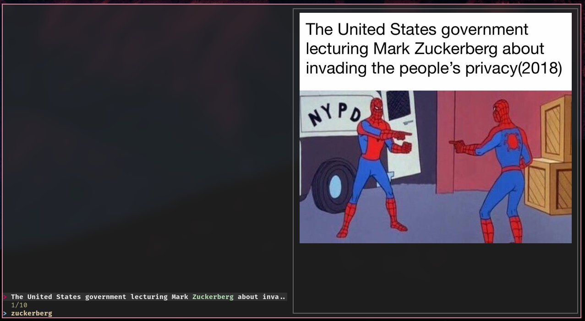

# miui

Build a searchable index of images by looking at the text inside the images.

Perfect for your unsorted meme directory where you just want to recall that one
image that talked about a "bulletsponge" or something like that.

Built during a lab day at work. Not to be taken too seriously.

## How it works

You index a directory of images and the text that can be recognized in the
image is saved in a metadata file under `.miui`.

You can then search inside these metadata files and map the metadata filename
back to the original filename. The built-in search uses fzf.

## Required software

**For indexing:**

* `tesseract` - OCR software. Must also have the English dataset installed.
* `imagemagic` - To preprocess the images during indexing.

**For built-in search tool:**

* `fzf` - The fuzzy-finder used to present the search interface.
* `kitty` - The only supported terminal right now in order to get image previews. (Easy to fix!)

## Screenshots

## License

Licensed under Apache License 2.0.

Copyright © Magnus Bergmark 2019
